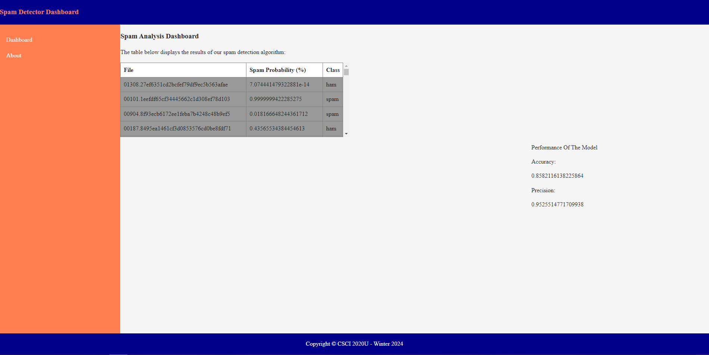

# Assignment 01 - Spam Detector
CSCI 2020U: Software Systems Development and Integration

## Overview
The purpose of the project is to filter out spam emails from your inbox. To achieve this our program has been trained to look through each email, word by word,
and ultimately determine the probability of each email being spam.

# Improvements

One improvement that was made compared to the base model program was the addition of a dictionary to the spamDectector's email reading.
This was done in order to ignore all of the random symbols and indistinguishable text within the emails to strictly focus on the proper English words that are most likely to 
be found within spam emails.

Due to time constraints and internal issues with communication with some of our group members we were unfortunately unable to make any improvements to the base interface.

# Instructions on how to run the project.

## Step 1
Clone the project from : 
- `https://github.com/OntarioTech-CS-program/w24-csci2020u-assignment01-ajibola-abdiani-patel-hanley`

## Step 2
- Open the project in intellij
- Run the project using a glassfish server

## Step 3 
- Make sure all of the endpoints are working:
- - `http://localhost:8080/spamDetector-1.0/api/spam`
- - `http://localhost:8080/spamDetector-1.0/api/spam/accuracy`
- - `http://localhost:8080/spamDetector-1.0/api/spam/precision`
- Open the index.html file in a browser and test out the webpage yourself

# Group Members and Contributions
- Jared Hanley - Backend Developer. (SpamDetector.java)
- Ife Ajibola - Backend and Frontend Developer. (SpamResource.java and main.js)
- Zohal Abdiani - Frontend Developer. (index.html, about.html, 404.html)

# Other Resources
The dictionary used to improve upon the model was received from [This website](https://www.mit.edu/~ecprice/wordlist.10000)